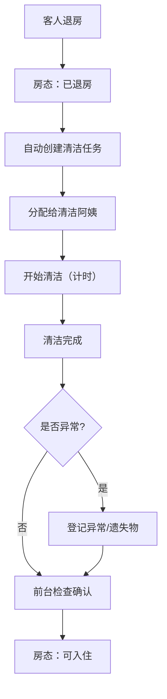

## 1. 产品概述

小型民宿管理后台系统，用于管理房间清洁、维修和客用品补给。系统面向民宿前台、清洁阿姨、维修人员和管理人员，提供房态可视化、任务分配、物资管理和数据统计功能，提升民宿运营效率和服务质量。

## 2. 核心功能

### 2.1 用户角色

| 角色 | 核心权限 |
|------|----------|
| 前台 | 查看房态、分配清洁任务、登记维修工单、领用物资 |
| 清洁阿姨 | 查看/领取清洁任务、记录开始/完成时间、上传异常照片、记录遗失物 |
| 维修人员 | 查看/处理维修工单、记录处理过程和结果 |
| 管理员 | 全部功能权限、查看统计报表 |

### 2.2 功能模块

1. **房态看板**: 房间状态总览（待入住、已退房、清洁中、可入住、停用房）
2. **清洁任务**: 任务分配、执行记录、异常上报、遗失物登记
3. **维修工单**: 故障登记、紧急程度、处理人指派、结果记录
4. **库存补给**: 客用品领用、库存预警、出入库记录
5. **统计分析**: 周转时间、返工次数、维修耗时、物资消耗

### 2.3 页面详情

| 页面名称 | 模块名称 | 功能描述 |
|-----------|-------------|---------------------|
| 房态看板 | 状态筛选栏 | 按楼层、房态类型筛选房间 |
| 房态看板 | 房间卡片网格 | 展示所有房间状态、房号、楼层、客人信息 |
| 房态看板 | 状态图例 | 显示5种房态颜色说明 |
| 房态看板 | 快速操作 | 快速修改房间状态、创建清洁/维修任务 |
| 清洁任务 | 任务列表 | 按楼层/状态/人员筛选清洁任务 |
| 清洁任务 | 任务分配 | 将任务按楼层分配给清洁阿姨 |
| 清洁任务 | 任务执行 | 记录开始/完成时间、异常照片、遗失物登记 |
| 清洁任务 | 任务详情 | 查看任务完整信息和处理历史 |
| 维修工单 | 工单列表 | 按状态/紧急程度/处理人筛选工单 |
| 维修工单 | 新建工单 | 登记故障位置、描述、紧急程度、上传照片 |
| 维修工单 | 工单处理 | 指派处理人、记录处理过程、完成结果 |
| 库存补给 | 物资列表 | 展示牙具、拖鞋、纸巾、饮用水的库存数量和预警状态 |
| 库存补给 | 领用登记 | 记录房间领用物资的数量和时间 |
| 库存补给 | 入库操作 | 登记物资入库、供应商信息 |
| 库存补给 | 出入库记录 | 展示所有出入库历史记录 |
| 统计分析 | 周转统计 | 平均清洁周转时间、按楼层/人员对比 |
| 统计分析 | 返工统计 | 清洁返工次数、返工原因分析 |
| 统计分析 | 维修统计 | 平均维修耗时、故障类型分布 |
| 统计分析 | 消耗统计 | 每间房物资消耗量、月度趋势 |

## 3. 核心流程

### 3.1 客房清洁流程
客人退房 → 前台标记已退房 → 系统自动创建清洁任务 → 按楼层分配给清洁阿姨 → 阿姨开始清洁（记录时间） → 清洁完成（记录时间、上传照片） → 如有异常/遗失物登记 → 前台检查确认 → 房间变更为可入住

### 3.2 维修处理流程
发现故障 → 前台/阿姨创建维修工单 → 选择紧急程度 → 指派维修人员 → 维修人员接单处理 → 记录处理过程 → 完成工单（记录结果和耗时） → 前台验收

### 3.3 物资补给流程
库存低于预警值 → 系统提示 → 管理人员采购入库 → 前台为房间领用物资 → 登记领用记录 → 库存实时更新

## 4. 用户界面设计

### 4.1 设计风格
- **主色调**: 深邃蓝 `#1e3a5f`（专业、稳重）
- **辅助色**: 暖琥珀 `#d4a853`（温馨、民宿调性）
- **状态色**: 
  - 可入住：翠绿 `#22c55e`
  - 待入住：天蓝 `#3b82f6`
  - 已退房：橙红 `#f97316`
  - 清洁中：紫色 `#a855f7`
  - 停用房：灰色 `#6b7280`
- **字体**: 标题使用"思源宋体"体现品质感，正文使用"思源黑体"保证可读性
- **布局**: 左侧导航栏 + 顶部状态栏 + 主内容区，卡片式布局
- **风格**: 现代商务与民宿温馨结合，圆角卡片、柔和阴影、留白充足

### 4.2 页面设计概览

| 页面名称 | 模块名称 | UI 元素 |
|-----------|-------------|-------------|
| 房态看板 | 房间卡片网格 | 彩色状态标签、房号大字、楼层角标、悬浮快速操作按钮、卡片阴影 |
| 清洁任务 | 任务列表 | 时间线式任务卡片、人员头像、状态进度条、操作按钮组 |
| 维修工单 | 工单卡片 | 紧急程度色条（红/黄/蓝）、故障位置标签、处理状态徽章 |
| 库存补给 | 物资卡片 | 库存进度条、预警红色闪烁、数量大字显示、领用按钮 |
| 统计分析 | 图表区域 | 柱状图对比、折线趋势、饼图分布、数据卡片配指标数字 |

### 4.3 响应式设计
- 采用桌面优先设计，最小适配 1366×768
- 侧边导航在平板宽度折叠为图标模式
- 房间卡片网格自适应列数
