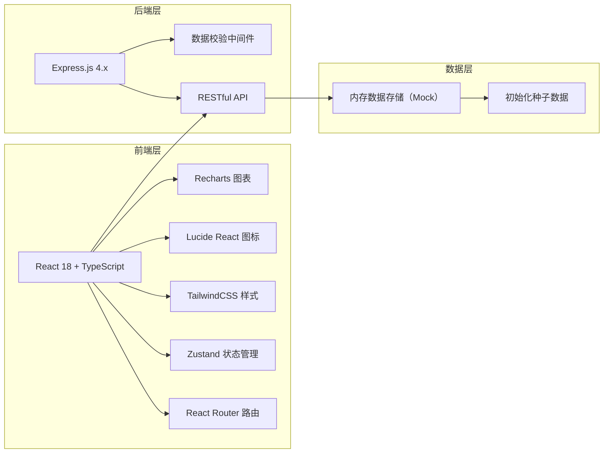
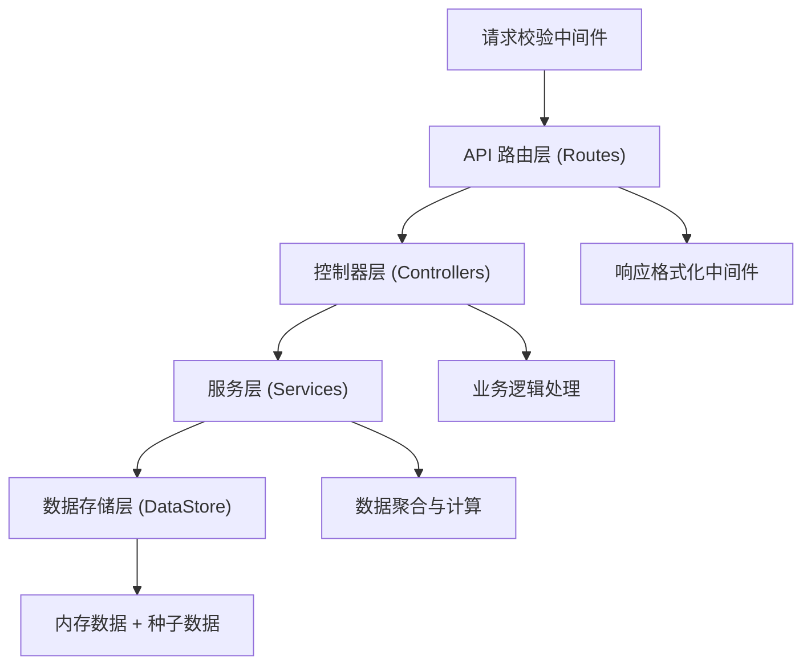
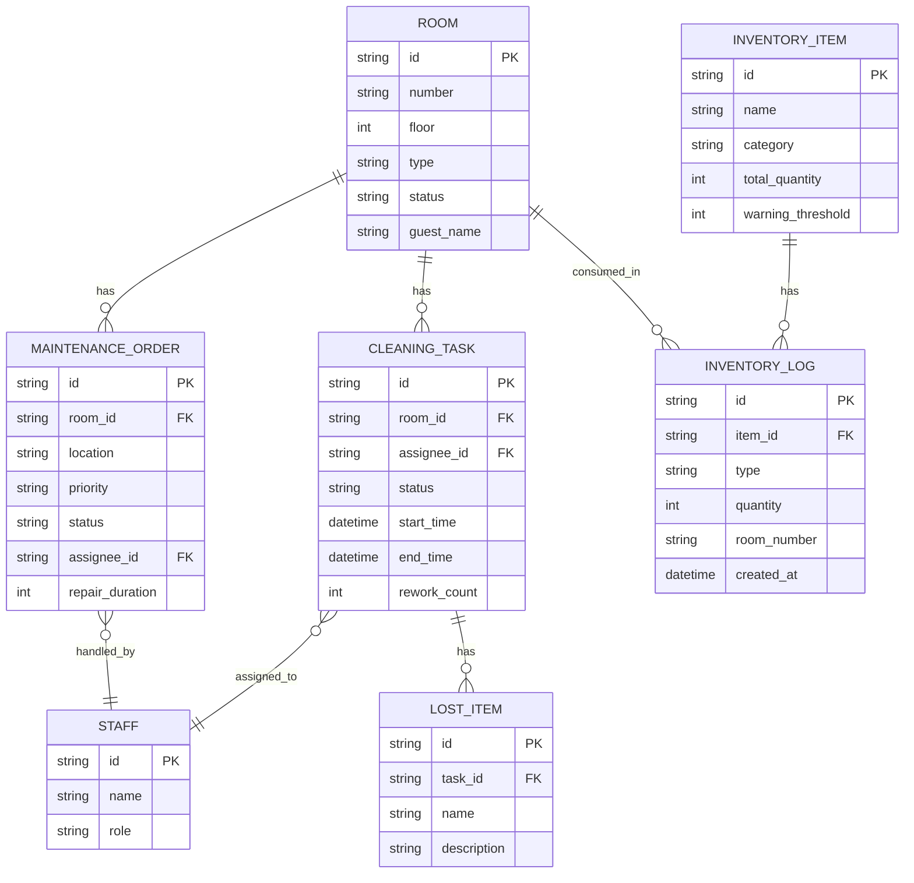

## 1. 架构设计



## 2. 技术说明

- **前端**: React@18 + TypeScript + Vite
- **样式**: TailwindCSS@3
- **状态管理**: Zustand
- **路由**: React Router DOM@6
- **图标**: Lucide React
- **图表**: Recharts
- **后端**: Express@4 + TypeScript
- **数据存储**: 内存数据结构（Mock 数据，用于演示）
- **初始化工具**: vite-init

## 3. 路由定义

| 路由 | 用途 |
|-------|---------|
| /dashboard | 房态看板（首页） |
| /cleaning | 清洁任务管理 |
| /maintenance | 维修工单管理 |
| /inventory | 库存补给管理 |
| /statistics | 统计分析 |

## 4. API 定义

### 4.1 房间相关

```typescript
// 房间状态类型
type RoomStatus = 'available' | 'pending' | 'checkout' | 'cleaning' | 'outOfService';

interface Room {
  id: string;
  number: string;
  floor: number;
  type: string;
  status: RoomStatus;
  guestName?: string;
  checkInTime?: string;
  checkOutTime?: string;
  notes?: string;
}

// GET /api/rooms - 获取房间列表（支持按楼层、状态筛选）
// PUT /api/rooms/:id/status - 更新房间状态
// GET /api/rooms/:id - 获取房间详情
```

### 4.2 清洁任务相关

```typescript
type CleaningStatus = 'pending' | 'inProgress' | 'completed' | 'rework';

interface CleaningTask {
  id: string;
  roomId: string;
  roomNumber: string;
  floor: number;
  assigneeId: string;
  assigneeName: string;
  status: CleaningStatus;
  startTime?: string;
  endTime?: string;
  photos: string[];
  anomalies: string[];
  lostItems: LostItem[];
  createdAt: string;
  completedAt?: string;
  reworkCount: number;
}

interface LostItem {
  id: string;
  name: string;
  description: string;
  photo?: string;
  foundAt: string;
}

// GET /api/cleaning - 获取清洁任务列表
// POST /api/cleaning - 创建清洁任务
// PUT /api/cleaning/:id - 更新任务（开始、完成、异常等）
// POST /api/cleaning/:id/lost-items - 登记遗失物
```

### 4.3 维修工单相关

```typescript
type MaintenanceStatus = 'pending' | 'inProgress' | 'completed' | 'cancelled';
type MaintenancePriority = 'low' | 'medium' | 'high' | 'urgent';

interface MaintenanceOrder {
  id: string;
  roomId: string;
  roomNumber: string;
  location: string;
  description: string;
  priority: MaintenancePriority;
  status: MaintenanceStatus;
  reporterName: string;
  assigneeId?: string;
  assigneeName?: string;
  photos: string[];
  createdAt: string;
  startedAt?: string;
  completedAt?: string;
  result?: string;
  repairDurationMinutes?: number;
}

// GET /api/maintenance - 获取维修工单列表
// POST /api/maintenance - 创建维修工单
// PUT /api/maintenance/:id - 更新工单状态、指派处理人
// PUT /api/maintenance/:id/complete - 完成工单并记录结果
```

### 4.4 库存相关

```typescript
interface InventoryItem {
  id: string;
  name: string;
  category: 'toiletries' | 'footwear' | 'tissue' | 'water';
  unit: string;
  totalQuantity: number;
  warningThreshold: number;
  lastRestockedAt?: string;
}

interface InventoryLog {
  id: string;
  itemId: string;
  itemName: string;
  type: 'in' | 'out';
  quantity: number;
  roomNumber?: string;
  operatorName: string;
  notes?: string;
  createdAt: string;
}

// GET /api/inventory - 获取库存列表
// POST /api/inventory/:id/restock - 入库操作
// POST /api/inventory/:id/consume - 领用操作
// GET /api/inventory/logs - 获取出入库记录
```

### 4.5 统计相关

```typescript
interface Statistics {
  avgCleaningTurnaroundMinutes: number;
  totalReworkCount: number;
  avgRepairDurationMinutes: number;
  consumptionPerRoom: {
    itemName: string;
    avgQuantity: number;
  }[];
  cleaningByPerson: { name: string; count: number; avgMinutes: number }[];
  repairsByType: { type: string; count: number }[];
  monthlyTrend: { month: string; cleaningCount: number; repairCount: number }[];
}

// GET /api/statistics - 获取统计数据
```

## 5. 服务器架构图



## 6. 数据模型

### 6.1 数据模型 ER 图



### 6.2 前端状态管理结构

```typescript
interface AppState {
  rooms: Room[];
  cleaningTasks: CleaningTask[];
  maintenanceOrders: MaintenanceOrder[];
  inventory: InventoryItem[];
  inventoryLogs: InventoryLog[];
  staff: Staff[];
  statistics: Statistics | null;
  currentUser: Staff;
  
  // 筛选状态
  filters: {
    roomStatus: RoomStatus | 'all';
    floor: number | 'all';
    cleaningStatus: CleaningStatus | 'all';
    maintenanceStatus: MaintenanceStatus | 'all';
  };
}
```
